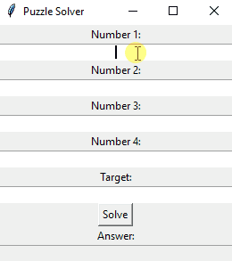
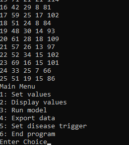
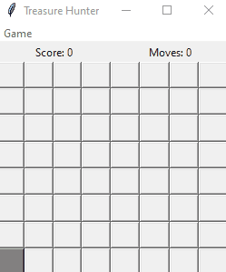
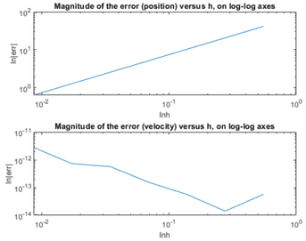
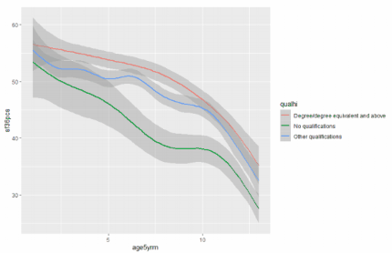
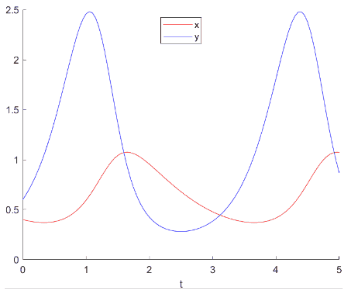
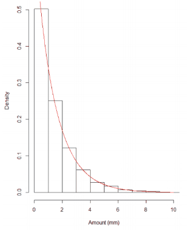

# Oliver David Mills
## Number Puzzle Solver
- Tkinter based GUI application
- All the numbers must be used
- Finds solution equal to target

## Fly Population Model
- Python based CLI application
- Simulates greenfly population
- Tracks juveniles, adults, seniles
- Can set birth rate, survival rate
- Random disease factor option
- Data is exportable to text file

 

## Treasure Hunter Game
- Get chests and avoid bandits
- Custom rulesets can be made
- Objects are placed randomly

 

## 2D Platformer
- PyGame coursework project
- Enemy pathfinding algorithm
- Level layouts stored in text file
- Object-oriented programming
- Encrypted sorted leaderboard
- Uses physics calculations

 

## Particle Modelling
- Thing

 

## Health Data Analysis
- Thing

  

## Population Modelling
- Thing

 

## Rainfall Data Analysis
- Thing

